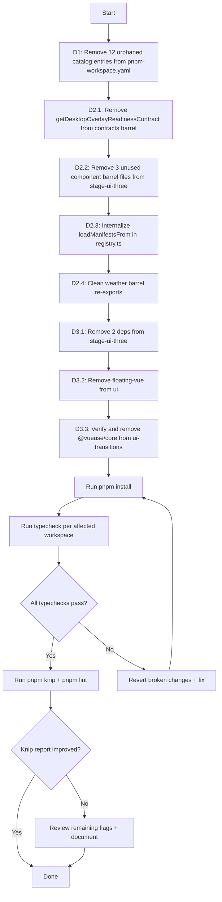

# Knip Cleanup Extended (Phase 2) — Design

## Approach

This spec extends the completed [`knip-cleanup`](.roo/specs/knip-cleanup/) work. All changes are surgical, file-level edits — no refactoring or feature changes. Each change area targets a specific file with minimal modifications.

**Key principle:** Every item in this spec has been manually verified against both `.ts` and `.vue` source files. Knip only scans `.ts` files, so dependencies and exports used exclusively in Vue SFCs appear as false positives. This spec excludes all false positives.

---

## Change Areas

### D1: Remove 12 Orphaned Catalog Entries

**Target file:** [`pnpm-workspace.yaml`](pnpm-workspace.yaml)

**Strategy:** Remove 12 catalog entries that no workspace references. These were orphaned by the previous dependency pruning pass.

**Changes — lines to remove:**

| Line | Entry | Reason |
|------|-------|--------|
| 7 | `'@electron/notarize': ^3.1.1` | No workspace references it |
| 22 | `'@proj-airi/iconify-meteocons': ^0.1.5` | No workspace references it |
| 23 | `'@proj-airi/unplugin-fetch': ^0.2.3` | No workspace references it |
| 24 | `'@shopify/draggable': ^1.2.1` | Removed from `stage-ui` in previous pass |
| 26 | `'@types/d3': ^7.4.3` | `d3` was removed in previous pass |
| 30 | `'@types/whatwg-mimetype': ^5.0.0` | No workspace references it |
| 35 | `'@xsai/embed': 0.5.0-beta.2` | No workspace references it |
| 50 | `d3: 7.9.0` | Removed from `stage-ui` in previous pass |
| 52 | `drizzle-orm: ^0.45.2` | No workspace references it |
| 58 | `hono: 4.11.3` | Removed from `stage-ui` in previous pass |
| 67 | `oxc-minify: ^0.126.0` | No workspace references it |
| 86 | `vite-plugin-mkcert: ^2.0.0` | No workspace references it |

**Rationale:** With `catalogMode: prefer` set at [line 95](pnpm-workspace.yaml:95), pnpm will try to use catalog versions when available. Orphaned entries could accidentally satisfy a future dependency request, creating confusion.

---

### D2: Remove Unused Barrel Re-Exports

#### D2.1: Remove `getDesktopOverlayReadinessContract` from contracts barrel

**Target file:** [`apps/stage-tamagotchi/src/main/windows/desktop-overlay/rpc/contracts.ts`](apps/stage-tamagotchi/src/main/windows/desktop-overlay/rpc/contracts.ts)

**Current content:**

```ts
export type { DesktopOverlayReadiness } from '../../../../shared/eventa'
export { getDesktopOverlayReadinessContract } from '../../../../shared/eventa'
```

**Change:** Remove line 2 (`export { getDesktopOverlayReadinessContract }`). The sole consumer [`index.electron.ts`](apps/stage-tamagotchi/src/main/windows/desktop-overlay/rpc/index.electron.ts:23) imports directly from `../../../../shared/eventa`, not from this barrel.

**After:**

```ts
export type { DesktopOverlayReadiness } from '../../../../shared/eventa'
```

**Verification needed:** Check if `DesktopOverlayReadiness` type export has external consumers before keeping it.

#### D2.2: Remove unused component barrel exports from stage-ui-three

**Target files:**

| File | Current Content | Change |
|------|----------------|--------|
| [`packages/stage-ui-three/src/components/Controls/index.ts`](packages/stage-ui-three/src/components/Controls/index.ts) | `export { default as OrbitControls } from './OrbitControls.vue'` | Remove entire file |
| [`packages/stage-ui-three/src/components/Environment/index.ts`](packages/stage-ui-three/src/components/Environment/index.ts) | `// export { default as DirectionalLight } from './DirectionalLight.vue'` + `export { default as SkyBox } from './SkyBox.vue'` | Remove entire file |
| [`packages/stage-ui-three/src/components/Model/index.ts`](packages/stage-ui-three/src/components/Model/index.ts) | `export { default as VRMModel } from './VRMModel.vue'` | Remove entire file |

**Additional check:** Verify that [`packages/stage-ui-three/package.json`](packages/stage-ui-three/package.json) `exports` field does not reference these barrel files. The current exports are:

```json
"./assets/vrm": "./src/assets/vrm/index.ts",
"./composables/vrm": "./src/composables/vrm/index.ts",
"./trace": "./src/trace/index.ts",
"./utils/vrm-preview": "./src/utils/vrm-preview.ts",
".": "./src/index.ts"
```

No export path references `./components/Controls`, `./components/Environment`, or `./components/Model`, so removing the barrel files is safe.

**Also check:** The main barrel [`packages/stage-ui-three/src/index.ts`](packages/stage-ui-three/src/index.ts) — verify it does not re-export from these component barrels. If it does, remove those re-export lines too.

#### D2.3: Internalize `loadManifestsFrom` in plugin host registry

**Target file:** [`apps/stage-tamagotchi/src/main/services/airi/plugins/host/registry.ts`](apps/stage-tamagotchi/src/main/services/airi/plugins/host/registry.ts)

**Change at line 58:** Remove `export` keyword from `loadManifestsFrom` function declaration.

```ts
// Before:
export async function loadManifestsFrom(

// After:
async function loadManifestsFrom(
```

**Rationale:** The function is only called at line 326 within the same file's `refresh()` method. No external file imports it.

#### D2.4: Clean weather barrel re-exports

**Target file:** [`apps/stage-tamagotchi/src/renderer/stores/tools/builtin/weather.ts`](apps/stage-tamagotchi/src/renderer/stores/tools/builtin/weather.ts)

**Current line 10:**

```ts
export { fetchWeather, geocodeCity, mapWmoCode } from './weather-api'
```

**Strategy:** Search for any file that imports `fetchWeather`, `geocodeCity`, or `mapWmoCode` from this barrel (the `weather.ts` file). The test file imports directly from `./weather-api`. If no other file imports from the barrel, remove the re-export line.

**Note:** `fetchWeather` is used at line 19 within the same file (`const weather = await fetchWeather(input.city)`). After removing the barrel re-export, `fetchWeather` must still be importable within the file. Change the import at line 6 from a re-export pattern to a regular import:

```ts
// Before (line 6):
import { fetchWeather } from './weather-api'

// Before (line 10):
export { fetchWeather, geocodeCity, mapWmoCode } from './weather-api'

// After (line 6 stays the same — already a regular import):
import { fetchWeather } from './weather-api'

// After (line 10 removed):
// No re-export line
```

---

### D3: Remove Confirmed Unused Dependencies

#### D3.1: packages/stage-ui-three — Remove 2 dependencies

**Target file:** [`packages/stage-ui-three/package.json`](packages/stage-ui-three/package.json)

**Packages to remove:**

| Package | Line | Verification |
|---------|------|-------------|
| `@proj-airi/stage-shared` | 32 | Zero imports in `.ts` and `.vue` |
| `@tresjs/cientos` | 34 | Zero imports in `.ts` and `.vue` |

**Command:**

```bash
pnpm --filter @proj-airi/stage-ui-three remove @proj-airi/stage-shared @tresjs/cientos
```

**Packages NOT removed (false positives — used in `.vue` files):**

| Package | Used In |
|---------|---------|
| `@tresjs/core` | `ThreeScene.vue`, `VRMModel.vue`, `SkyBox.vue`, `OrbitControls.vue` |
| `@tresjs/post-processing` | `ThreeScene.vue` |
| `culori` | `ThreeScene.vue` |
| `postprocessing` | `ThreeScene.vue` |
| `@proj-airi/ui` | `ThreeScene.vue` (imports `Screen`) |

#### D3.2: packages/ui — Remove `floating-vue`

**Target file:** [`packages/ui/package.json`](packages/ui/package.json)

**Package to remove:** `floating-vue` (line 31) — zero imports in `.ts` and `.vue` files under `packages/ui/src/`.

**Command:**

```bash
pnpm --filter @proj-airi/ui remove floating-vue
```

#### D3.3: packages/ui-transitions — Remove `@vueuse/core`

**Target file:** [`packages/ui-transitions/package.json`](packages/ui-transitions/package.json)

**Package to remove:** `@vueuse/core` (line 30) — zero direct imports in `.ts` and `.vue` files.

**Caveat:** `@vueuse/motion` (line 31) is a peer dependency. Check whether `@vueuse/motion` requires `@vueuse/core` as a peer dependency. If it does, `@vueuse/core` must remain. If not, it can be safely removed.

**Command (if safe to remove):**

```bash
pnpm --filter @proj-airi/ui-transitions remove @vueuse/core
```

---

## Flow Diagram



## Risk Assessment

| Risk | Mitigation |
|------|------------|
| Removing catalog entry that a future PR might need | Catalog entries are only useful when a `package.json` references them with `catalog:` protocol. Orphaned entries serve no purpose and can be re-added when needed. |
| Removing barrel re-export breaks an undiscovered consumer | Each barrel export verified with `search_files` across both `.ts` and `.vue` files before removal. |
| Removing `@vueuse/core` from ui-transitions breaks `@vueuse/motion` | Check `@vueuse/motion` peer dependency requirements before removal. If required, keep it. |
| Internalizing `loadManifestsFrom` breaks a test that imports it | Verify no test file imports `loadManifestsFrom` before removing `export`. |
| Removing component barrel files from stage-ui-three breaks `package.json` exports | Verified: no `package.json` export path references these barrel files. |